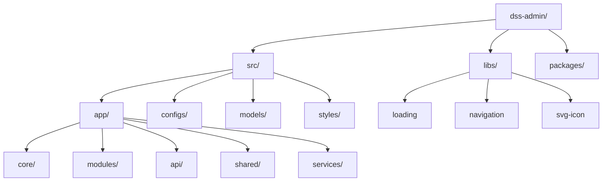

# Project Architecture - DSS Admin

This document provides a comprehensive overview of the architecture and technical foundation of the **DSS Admin** project.

## 🏗️ Core Technology Stack

- **Framework**: [Angular 20.x](https://angular.dev/) (Standalone Components, v20+ Best Practices)
- **Primary Language**: [TypeScript 5.8+](https://www.typescriptlang.org/)
- **UI Framework**: [NG-ZORRO](https://ng.ant.design/) (Ant Design for Angular)
- **Styling**: [Tailwind CSS 4.0](https://tailwindcss.com/) + [DaisyUI](https://daisyui.com/)
- **State Management**: [Angular Signals](https://angular.dev/guide/signals) & [RxJS](https://rxjs.dev/)
- **Validation**: [Zod](https://zod.dev/)
- **Real-time**: [ASP.NET Core SignalR](https://learn.microsoft.com/en-us/aspnet/core/signalr/introduction)
- **Observability**: [OpenTelemetry](https://opentelemetry.io/)
- **Utilities**: `es-toolkit`, `date-fns`, `dayjs`, `nanoid`, `exceljs`

---

## 📂 Directory Structure

The project follows a modular, feature-based architecture with separated core and shared layers.

### 1. `src/app/core/`

The backbone of the application. Contains singleton services, global guards, interceptors, and the layout system.

- **`auth/`**: Authentication logic, token management.
- **`guard/`**: `AuthGuard` and `NoAuthGuard` for route protection.
- **`layouts/`**: Multi-layout system (Dense, Empty, Modern).
- **`error-tracking/`**: Integration with OpenTelemetry for global error monitoring.

### 2. `src/app/modules/`

Feature-based modules. Each feature is encapsulated within its own directory and uses **lazy loading** via `routes.ts` files.

- `auth/`: Login, password recovery.
- `users/`: Staff, MD, SD management.
- `sale/`: Products, categories, orders, coupons, promotions.
- `administration/`: System settings, configurations.
- `warehouse/`: Inventory management.

### 3. `src/app/api/`

Centralized API layer. Contains service definitions and data models for communicating with backend services.

### 4. `src/app/shared/`

Reusable components, directives, and pipes used across multiple feature modules.

### 5. `libs/`

Internal shared libraries that are independent of the main app logic (e.g., SVG icon handler, loading overlay).

---

## 🛠️ Key Architectural Patterns

### 1. Standalone First

The project is built entirely using **Angular Standalone Components**. There are no `NgModules`, simplify dependency management and improving tree-shaking.

### 2. Signal-Based Reactivity

Leverages **Angular Signals** (`signal`, `computed`, `effect`) for state management, providing a more granular and efficient change detection mechanism than traditional zone-based approaches.

### 3. Multi-Layout System

Managed by `LayoutComponent` in `core/layouts`. The layout is dynamically selected based on route data:

- `layout: 'dense'`: Standard admin dashboard layout.
- `layout: 'empty'`: Full-page layout for auth or error pages.

### 4. Permission-Based Access Control (RBAC)

Uses `ngx-permissions` integrated with functional guards. Permissions are defined centrally in `src/configs/permissions.ts` and checked during route activation.

### 5. Modern Component Styling

Combines the power of **NG-ZORRO** for complex UI components (Modals, Tables, Selects) with **Tailwind CSS 4.0** for utility-first layout and fine-tuned styling.

---

## 🔍 Observability & Monitoring

The application includes a robust monitoring system using **OpenTelemetry**:

- **Tracing**: Captures user interactions and API call chains.
- **Logging**: Captures global errors and performance metrics via `provideErrorTracking`.
- **Metrics**: Tracks web vitals and custom application metrics.

---

## 🚀 Build & Deployment

- **Environment Config**: Uses standard Angular `environments/` for staging and production.
- **CI/CD**: Build scripts located in `.ci/build.sh`.
- **Containerization**: `Dockerfile` and `nginx.conf` provided for Docker-based deployments.
