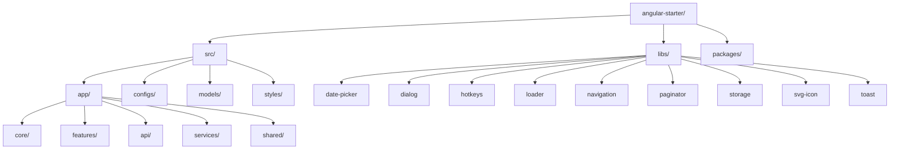

# Project Architecture - Angular Starter

This document provides a comprehensive overview of the architecture and technical foundation of the **Angular Starter** project.

## 🏗️ Core Technology Stack

- **Framework**: [Angular 22](https://angular.dev/) (Standalone Components by default, Modern Control Flow, Signals)
- **Primary Language**: [TypeScript 6.0+](https://www.typescriptlang.org/)
- **UI Framework**: [DaisyUI 5](https://daisyui.com/)
- **Styling**: [Tailwind CSS 4.0](https://tailwindcss.com/) (with `@tailwindcss/postcss`)
- **State Management**: [Angular Signals](https://angular.dev/guide/signals) & [RxJS](https://rxjs.dev/)
- **Validation**: [Zod 4](https://zod.dev/)
- **Testing**: [Vitest](https://vitest.dev/) & [jsdom](https://github.com/jsdom/jsdom)
- **Core Utilities**: `es-toolkit`, `dayjs`, `exceljs`, `swiper`, `@lottiefiles/dotlottie-wc`, `@angular/aria`, `@angular/cdk`, `ngx-permissions`
- **Code Quality**: ESLint 10, Prettier 3, Husky 9, lint-staged 16

---

## 📂 Directory Structure

The project follows a modular, feature-based architecture with separated core and shared layers.

```mermaid
graph TD
    Root[angular-starter/] --> Src[src/]
    Root --> Libs[libs/]
    Root --> Packages[packages/]

    Src --> App[app/]
    Src --> Configs[configs/]
    Src --> Models[models/]
    Src --> Styles[styles/]

    App --> Core[core/]
    App --> Features[features/]
    App --> Api[api/]
    App --> Services[services/]
    App --> Shared[shared/]

    Libs --> DatePicker[date-picker]
    Libs --> Dialog[dialog]
    Libs --> Hotkeys[hotkeys]
    Libs --> Loader[loader]
    Libs --> Navigation[navigation]
    Libs --> Paginator[paginator]
    Libs --> Storage[storage]
    Libs --> SVGIcon[svg-icon]
    Libs --> Toast[toast]
```

### 1. `src/app/core/`

The backbone of the application. Contains singleton services, global guards, interceptors, and the layout system.

- **`auth/`**: Authentication logic, token management, session handling.
- **`guard/`**: `AuthGuard` and `NoAuthGuard` for route protection.
- **`layouts/`**: Multi-layout system (`dense`, `empty`, `modern`).
- **`commons/`**: Core utilities, base classes, and interceptors.

### 2. `src/app/features/`

Feature-based modules. Each feature is encapsulated within its own directory and uses **lazy loading** via `routes.ts` files.

- `auth/`: Sign-in, sign-up, forgot-password, reset-password, access-denied.
- `example/`: Example feature demonstrating dialogs, datepickers, loaders, toasts, and icons.
- `not-found/`: 404 handler page.

### 3. `src/app/api/`

Centralized API layer. Contains base classes, operators, helpers, data models, and API resources for backend communication.

- `base/`: `BaseApiService`, API list interfaces, response operators.
- `resources/`: Dedicated services per entity (e.g., `ExampleAPIService`).
- `models/`: API data models and Zod schemas.

### 4. `src/app/services/`

Cross-cutting application-level services (e.g., `UserService`).

### 5. `src/app/shared/`

Reusable UI components, directives, and pipes used across multiple feature modules.

### 6. `libs/` & `packages/` (`@libs/*`)

Internal shared libraries mapped via TypeScript path aliases:

- `@libs/ui/toast`: Toast notification service (`ToastService`).
- `@libs/ui/dialog`: Dialog and modal management (`DialogService`).
- `@libs/ui/loader`: Global and overlay loaders (`LoaderService`).
- `@libs/ui/svg-icon`: SVG icon renderer (`SvgIcon`).
- `@libs/ui/date-picker`: Date picker components and adapters (`DatepickerModule`).
- `@libs/ui/paginator`: Table and list pagination component.
- `@libs/hotkeys`: Keyboard shortcut bindings.
- `@libs/storage`: Local/session storage abstractions.
- `@libs/navigation`: Navigation menu and sidebar controls.

---

## 🛠️ Key Architectural Patterns

### 1. Standalone First

The project is built entirely using **Angular Standalone Components**. In Angular 22, components are standalone by default, eliminating `NgModules`, simplifying dependency graphs, and enhancing tree-shaking.

### 2. Modern Control Flow

Templates leverage built-in control flow syntax:

- `@if` / `@else`
- `@for` with mandatory `track`
- `@switch` / `@case` / `@default`

### 3. Signal-Based Reactivity

Leverages **Angular Signals** (`signal`, `computed`, `effect`) for granular, high-performance state management alongside `ChangeDetectionStrategy.OnPush`.

### 4. Multi-Layout System

Managed by `LayoutComponent` in `core/layouts`. The layout is dynamically selected based on route data:

- `layout: 'dense'`: Standard dashboard layout with sidebar and header.
- `layout: 'modern'`: Modern dashboard layout.
- `layout: 'empty'`: Full-page layout for auth or standalone pages.

### 5. Permission-Based Access Control (RBAC)

Uses `ngx-permissions` integrated with functional guards (`ngxPermissionsGuard`). Permissions are defined in `src/configs/permission.config.ts` and evaluated during route navigation.

### 6. Modern Component Styling

Combines **DaisyUI 5** component classes with **Tailwind CSS 4.0** utility classes and CSS theme variables defined in `src/styles/` (`_colors.css`, `_themes.css`, `_daisyui.css`).

---

## 🧪 Testing & Code Quality

- **Unit Testing**: Powered by **Vitest** and **jsdom** via `ng test` for lightning-fast testing.
- **Linting & Formatting**: Automated via **ESLint 10** (`angular-eslint`) and **Prettier 3** with Tailwind and organize-imports plugins.
- **Git Hooks**: Managed by **Husky** and **lint-staged** to ensure clean commits adhering to Conventional Commits.

---

## 🚀 Build & Deployment

- **Environment Config**: Uses `src/environments/` for staging and production configurations.
- **CI Scripts**: Build helpers located in `.ci/build-libs.js`.
- **Production Build**: Output via `@angular/build` (`ng build --configuration production`).
