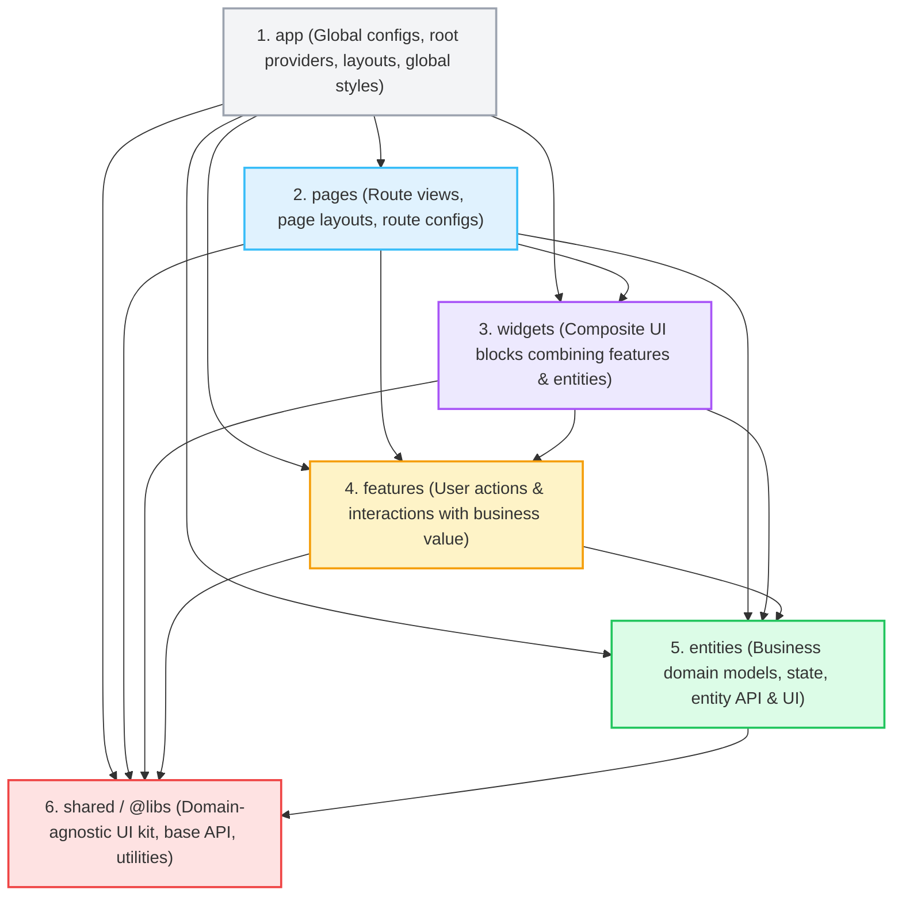
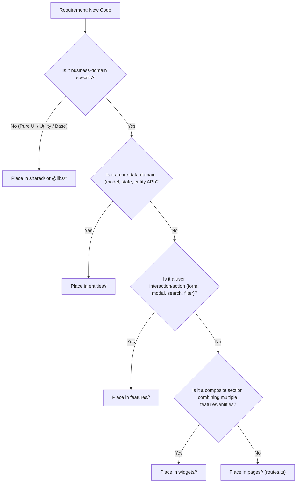

# Feature-Sliced Design (FSD) Architecture Rules

This document defines the architectural rules, directory organization, and dependency constraints for organizing code according to **Feature-Sliced Design (FSD)** in this Angular Starter project. All AI agents and developers must strictly adhere to these rules when creating, moving, or refactoring code.

---

## 🎯 Core Principles

Feature-Sliced Design decomposes the frontend codebase into three structural tiers:

1. **Layers**: Standardized horizontal strata ordered by level of abstraction and business specificity.
2. **Slices**: Vertical partitions within each layer organized strictly around **business domains**.
3. **Segments**: Technical groupings within each slice (`ui`, `model`, `api`, `lib`, `config`).



---

## 📐 The 6 Layers (Top to Bottom)

Imports MUST flow strictly from top to bottom. A layer may only import from layers strictly below it.

| Layer | Responsibility | Location | Can Import From |
| :--- | :--- | :--- | :--- |
| **`app`** | Application bootstrap, root providers (`app.config.ts`), root routing (`app.routes.ts`), global layout wrappers, and global stylesheet imports. | `apps/main/src/app/`, `apps/main/src/styles/` | `pages`, `widgets`, `features`, `entities`, `shared` |
| **`pages`** | Full-page route views assembled from widgets, features, and entities. Owns lazy-loaded route definitions (`routes.ts`) and route data/resolvers. | `apps/main/src/app/pages/` (or `features/` acting as page routes) | `widgets`, `features`, `entities`, `shared` |
| **`widgets`** | Self-contained, composite UI blocks combining multiple features and entities (e.g. `header`, `sidebar`, `user-profile-card`, `order-summary`). | `apps/main/src/app/widgets/` | `features`, `entities`, `shared` |
| **`features`** | User actions and workflows that bring business value (e.g. `sign-in`, `sign-up`, `order-filter`, `product-search`, `export-excel`). | `apps/main/src/app/features/` | `entities`, `shared` |
| **`entities`** | Core business domains (e.g. `user`, `product`, `order`, `category`). Contains domain models, Zod schemas, entity signals/store, entity API resources, and entity-specific presentation UI (e.g. `user-avatar`, `product-card`). | `apps/main/src/app/entities/` | `shared` |
| **`shared`** | Business-agnostic infrastructure, reusable UI primitives, base API clients, HTTP interceptors, pure utilities, and design tokens. | `apps/main/src/app/shared/`, `libs/ui/` (`@libs/*`) | External packages, third-party libraries only |

---

## 🧩 Slices & Segments

### 1. Slices (Lát cắt nghiệp vụ)

Except for `app` and `shared`, every layer is organized into **Slices** named after business domain concepts:
- In `entities`: `user/`, `product/`, `order/`, `category/`
- In `features`: `auth/` (with `sign-in/`, `sign-up/`), `order-filter/`, `export-excel/`
- In `widgets`: `header/`, `sidebar/`, `user-profile-card/`
- In `pages`: `auth/`, `dashboard/`, `orders/`, `profile/`

### 2. Standard Segments (Phân đoạn kỹ thuật)

Inside every slice, organize files into standard technical segments:

```
feature-or-entity-name/
├── ui/                 # Presentation: Standalone components, dialogs, templates
│   ├── example-form.component.ts
│   └── example-form.component.html
├── model/              # State & Domain: Signals, store, models, Zod schemas, types
│   ├── example.model.ts
│   ├── example.schema.ts
│   └── example.store.ts
├── api/                # Data Access: Services extending BaseApiService, endpoints
│   └── example-api.service.ts
├── lib/                # Pure Logic: Helpers, validators, transformers specific to slice
│   └── example.validators.ts
├── config/             # Configuration: Slice-specific constants, tokens, permissions
│   └── example.config.ts
└── index.ts            # Mandatory Public API entry point
```

> **Note**: Segments are optional if the slice does not require them. For example, a pure UI feature slice might only have `ui/` and `index.ts`. However, when present, they MUST follow these standard segment names.

---

## 🔒 The 4 Golden Rules of FSD

### Rule 1: Directional Dependency Rule (Top-to-Bottom Only)
- A file in a given layer may **ONLY** import from layers strictly below it.
- **NEVER** import upwards:
  - ❌ `entities` importing from `features` or `widgets`
  - ❌ `features` importing from `widgets` or `pages`
  - ❌ `shared` importing from `entities`, `features`, or `pages`

### Rule 2: No Cross-Slice Imports on the Same Layer
- Slices on the same layer **MUST NOT** import from each other directly:
  - ❌ `features/auth` CANNOT import from `features/order-filter`.
  - ❌ `entities/user` CANNOT import from `entities/order`.
- **How to resolve cross-slice needs**:
  1. **Move Shared Logic Down**: If two features need the same data model or helper, extract it into an `entity` or `shared`.
  2. **Compose in a Higher Layer**: If a view needs both `features/auth` and `features/order-filter`, combine them inside a `widget` or a `page`.

### Rule 3: Strict Public API Isolation via `index.ts`
- Every slice **MUST** expose its public API through an `index.ts` at the root of the slice.
- External code **MUST ONLY** import from the slice root (`index.ts`).
- **NEVER** deep-import internal slice segments:
  - ✅ `import { SignInFormComponent } from '@/features/auth/sign-in';`
  - ❌ `import { SignInFormComponent } from '@/features/auth/sign-in/ui/sign-in-form.component';` (Deep import violation!)

### Rule 4: Domain-Agnostic Shared Layer
- Code in `shared/` and `@libs/*` MUST NOT contain any business-domain concepts, entity names, or feature-specific logic.
- If a component or helper contains domain logic (e.g. knowing what a "Customer" or "Invoice" is), it belongs in `entities/` or `features/`, NEVER in `shared/` or `@libs/*`.

---

## 🗺️ Mapping Existing Code to FSD

| Existing Directory | Target FSD Layer | Description |
| :--- | :--- | :--- |
| `apps/main/src/app/core/layouts/` | `widgets/layouts/` or `app/layouts/` | Shell layouts (`dense`, `empty`, `modern`). |
| `apps/main/src/app/core/guard/` | `app/guards/` | Global route protection guards. |
| `apps/main/src/app/features/auth/sign-in` | `features/auth/sign-in/` or `pages/auth/sign-in/` | Split into `features/auth/sign-in` (form/action) and `pages/auth/sign-in` (page route). |
| `apps/main/src/app/services/user.service.ts` | `entities/user/model/user.store.ts` | User state and domain store. |
| `apps/main/src/app/api/resources/` | `entities/<entity>/api/` | Entity-specific API services extending `BaseApiService`. |
| `apps/main/src/app/api/base/` | `shared/api/base/` | `BaseApiService`, API list operators, response handlers. |
| `libs/ui/*` (`@libs/ui`) | `shared/ui/` | Design system primitives (Button, Dialog, Toast, Paginator, etc.). |

---

## 🛠️ Step-by-Step Guide for Agents

When implementing a new requirement or feature:



### Checklist for Every New Slice:
1. [ ] Create slice directory in the appropriate layer: `features/<name>/`, `entities/<name>/`, `widgets/<name>/`, or `pages/<name>/`.
2. [ ] Divide into technical segments: `ui/`, `model/`, `api/`, `lib/`, `config/`.
3. [ ] Use **Standalone Components** (`changeDetection: ChangeDetectionStrategy.OnPush`).
4. [ ] Prefix signals with `$` (`$state`, `$data`) and streams with `$` (`destroy$`).
5. [ ] Prefix injected services with `_` using `inject()`.
6. [ ] Create `index.ts` exporting only the public API of the slice.
7. [ ] Verify no illegal upward or cross-slice imports are made.
8. [ ] Verify all external consumers import from `@/.../<slice>` via `index.ts`.
